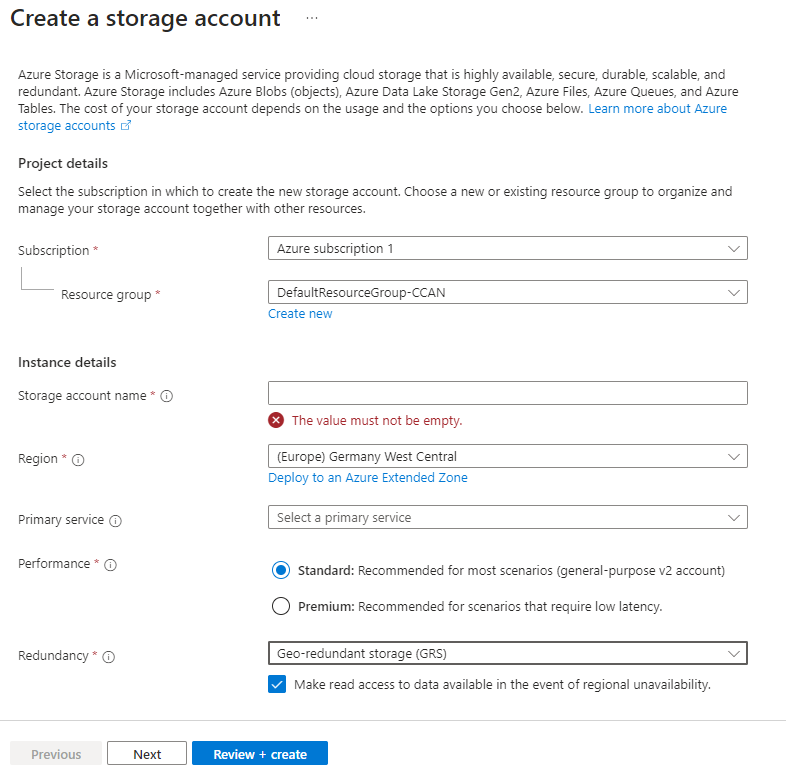
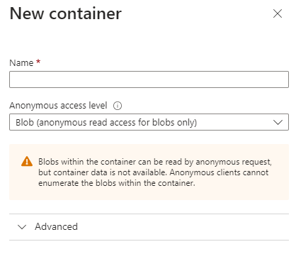
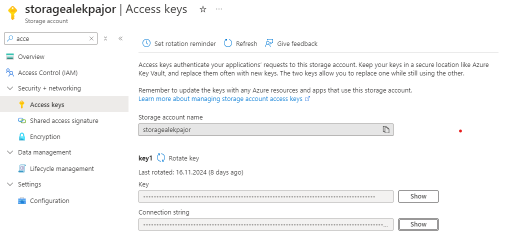
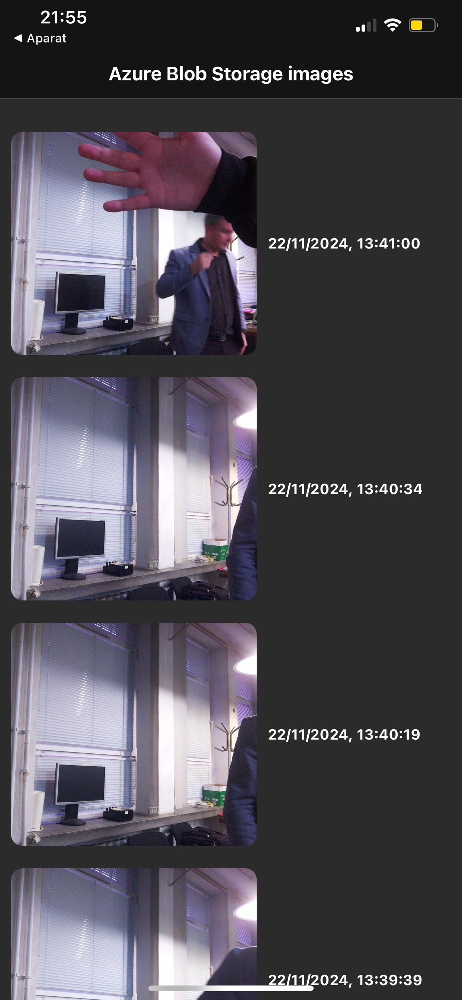

# Usługi i aplikacje Internetu Rzeczy - projekt
## Kamera z czujnikiem ruchu połączona z aplikacją mobilną

#### Aleksander Pajorski, Jan Narożny

### 1. Raspberry Pi

#### 1.1 Wymagane elementy

- Raspberry Pi
- Kompatybilna kamera (https://help.prusa3d.com/pl/article/camera-compatibility-rpi-prusalink_654918)
- Kompatybilny czujnik ruchu PIR

Raspberry Pi powinno być zaktualizowane do najnowszej dystrybucji Raspbian OS 'bookworm'. Należy wykonać 

    sudo apt update && sudo apt full-upgrade

aby upewnić się że bibloteki potrzebne do obsługi kamery są dostępne i aktualne.

#### 1.2 Podłączenie kamery i czujnika

Kamerę podączyć należy przy użyciu dedykowanego kabla oraz portu na płytce Pi. Kabel musi być dokładnie osadzony, częścią z kontaktami skierowany w przeciwnym kierunku niż zatrzask, a sam zatrzask równie dociśnięty. Czujnik ruchu podłączyć według poniższego schematu:


Czujnik ruchu posiada 3 piny: Vcc, Gnd, oraz Out. Powinne być one podpisane. Powyższy schemat jest poglądowy ponieważ w zależności od użytej wersji płytki ułożenie pinów GPIO może się różnić. Pin Vcc na czujniku podłączyć do pinu zasilającego 5V, pin Gnd do analogcznego pinu na płytce Pi, a Out do któregokolwiek z pinów GPIO. W tym przypadku użyty został pin 4. Do przetestowania podłączenia czujnika ruchu: 

#### 1.3 Stworzenie środowiska wirtualnego

    python3 -m venv venv

    # windows:
    venv\Scripts\activate

    # macOS i linux:
    source venv/scripts/activate

    pip install -r requirements.txt

#### 1.4 Weryfiakcja podłączenia kamery i czunika

Aby zweryfikować poprawne podłączenie czujnika:
    
    python3 pirTest.py

Zakończyć ctrl+c. Następnie aby zweryfikować podłączenie kamery:

    rpicam-still -n -o test.jpg

#### 1.5 Chmura azure
Zdjęcia przesyłane są do chmury azure, na którym założony został serwis Azure Blob Storage do przetrzymywania danych. Ze strony głownej Azure Portal należy wybrać "Create resource" i dodać do swojej grupy zasobów "Storage account". 



W tym miejscu trzeba uzupełnić niezbędne pola: nadać nazwę, wybrać najbliższy region, primary service może zostać puste, Performance ustawić na standard a Redundancy na Locally redundant storage dla najniższych kosztów.

Po utworzeniu tego zasobu należy go otworzyć, z lewego menu wybrać opcję Containers, i kliknąć opcję dodania kontenera. Opcje zaawansowane na potrzeby tego projektu są zbędne, więc wystarczy nadać mu nazwę i wybrać poziom dostępu.



Następnie należy przejść do "Access keys" i pamietać o skopiowaniu "Connection string" do kodu na raspberry pi (czy jakimkolwiek innym urządzeniu, które będzie chciało uzyskać dostęp do tego Blob Storage).



#### 1.6 Aplikacja mobilna
Aplikacja mobilna napisana została przy użyciu frameworka React Native oraz Expo w języku TypeScript. PhotoGallery jest głównym komponentem aplikacji. Po jej otwarciu zdjęcia wczytywane są automatycznie, lecz nie są automatycznie odświeżane i w przypadku nadejścia nowego zdjęcia należy ręcznie odświeżyć stronę przesuwając palcem w dół do ukazania się kółka ładowania. Obok zdjęć znajduje się data oraz godzina ich utworzenia.



```
import React, { useEffect, useState } from 'react';
import { View, Text, FlatList, Image, ActivityIndicator, StyleSheet } from 'react-native';
import { BlobServiceClient } from '@azure/storage-blob';

const PhotoGallery = () => {
  const [photos, setPhotos] = useState<any[]>([]);
  const [loading, setLoading] = useState<boolean>(true);
  const [refreshing, setRefreshing] = useState<boolean>(false);

  const fetchImages = async () => {
    try {
      setLoading(true);
      const blobServiceClient = new BlobServiceClient("https://storagealekpajor.blob.core.windows.net");
      const containerClient = blobServiceClient.getContainerClient('photos');
  
      const imageDetails: any[] = [];
      for await (const blob of containerClient.listBlobsFlat()) {
        if (blob.name) {
          const blockBlobClient = containerClient.getBlockBlobClient(blob.name);
          const properties = await blockBlobClient.getProperties();
          const lastModified = properties.lastModified;
          const imageUrl = `${containerClient.url}/${blob.name}`;
          imageDetails.push({ imageUrl, lastModified });
        }
      }
  
      const sortedImages = imageDetails.sort((a, b) => {
        if (a.lastModified && b.lastModified) {
          return b.lastModified.getTime() - a.lastModified.getTime();
        }
        return 0;
      });
  
      setPhotos(sortedImages);
      setLoading(false);
      setRefreshing(false);
    } catch (error) {
      console.error('Error fetching images:', error);
      setLoading(false);
      setRefreshing(false);
    }
  };
  

  useEffect(() => {
    fetchImages();
  }, []);

  const onRefresh = () => {
    setRefreshing(true);
    fetchImages();
  };

  if (loading) {
    return (
      <View style={styles.loaderContainer}>
        <ActivityIndicator size="large" color="#aaaaaa" />
      </View>
    );
  }

  return (
    <FlatList
      style={{ backgroundColor: "#2b2b2b" }}
      data={photos}
      keyExtractor={(item, index) => index.toString()}
      renderItem={({ item }) => (
        <View style={styles.itemContainer}>
          <Image source={{ uri: item.imageUrl }} style={styles.image} />
          <Text style={styles.time}>
            {item.lastModified?.toLocaleString() || "Unknown"}
          </Text>
        </View>
      )}
      onRefresh={onRefresh}
      refreshing={refreshing}
    />
  );
};

const styles = StyleSheet.create({
  loaderContainer: {
    flex: 1,
    justifyContent: 'center',
    alignItems: 'center',
  },
  itemContainer: {
    flexDirection: 'row',
    margin: 10,
    alignItems: 'center',
  },
  image: {
    width: 220,
    height: 200,
    borderRadius: 10,
  },
  time: {
    marginLeft: 10,
    fontSize: 13,
    color: 'white',
    fontWeight: '700',
  },
});

export default PhotoGallery;
```

Paczka "@azure/storage-blob" daje gotowe API do komunikacji z Azure Blob Storage. Funkcja fetchImages() tworzy instancję BlobServiceClient z podanego linku do zasobu oraz pobiera z podanego kontenera wszystkie dane. Z każdego pobranego Blob'a następnie wyciąga pola związane z URL do zdjęcia (do jego wyświetlania) oraz ostatnią modyfikacją (do wyświetlania daty i godziny jego dodania). Później zdjęcia są sortowane po dacie dodania tak, żeby jako pierwsze wyświetlały się najnowsze zdjęcia i ostatecznie przypisywana jest lista struktur ```{ imageUrl, lastModified }```.